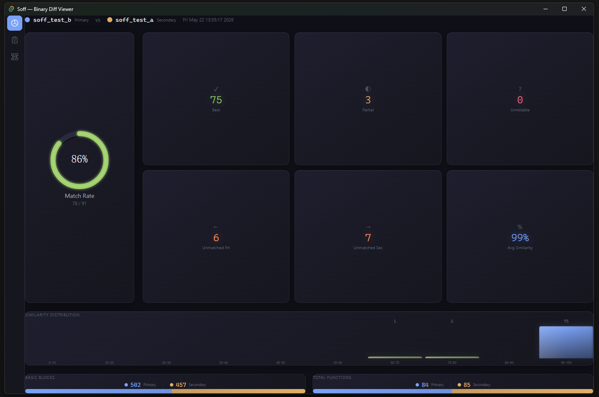
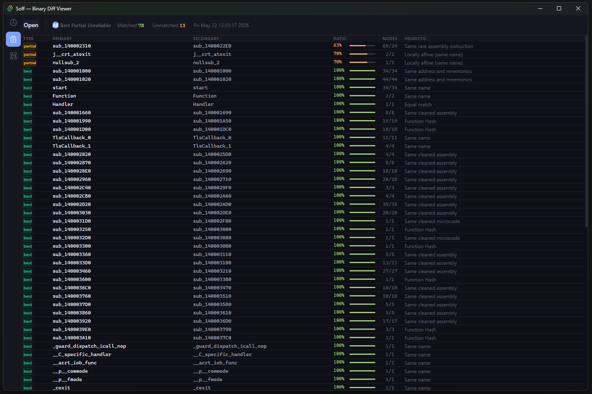
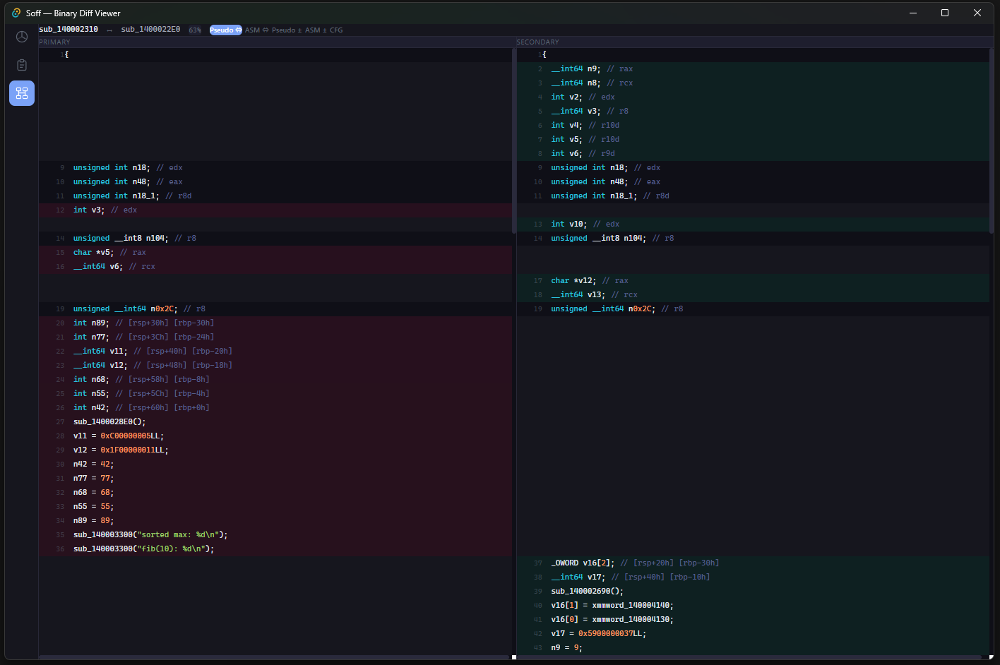

# Soff

高性能 IDA Pro 二进制差异分析引擎。从 IDA 数据库导出函数特征，使用 40+ 启发式算法识别跨版本的匹配、修改和未匹配函数。



## 组件

| 组件 | 说明 |
|------|------|
| `soff.dll` / `.so` / `.dylib` | IDA Pro 插件 (IDA 9.0+) |
| `soff_cli` | 命令行差异工具 |
| `soff-desktop` | 独立结果查看器 (Tauri 应用) |

## 安装

将插件复制到 IDA 的 plugins 目录：

```
# Windows
copy soff.dll "%IDADIR%\plugins\"

# Linux
cp soff.so "$IDADIR/plugins/"

# macOS
cp soff.dylib "$IDADIR/plugins/"
```

## 使用方法

### IDA 插件

加载插件后，IDA 菜单栏会出现顶层 **Soff** 菜单：

| 菜单项 | 说明 |
|--------|------|
| **Export current IDB** | 将当前数据库的函数特征导出为 `.sqlite` 文件 |
| **Diff SQLite databases** | 比较两个导出的 `.sqlite` 文件，生成 `.soff` 结果 |
| **Load Diff Results** | 加载之前保存的 `.soff` 结果到 chooser 中查看 |
| **Save Diff Results As** | 将当前差异结果另存为新的 `.soff` 文件 |
| **Import Diff Results** | 将 `.soff` 结果应用到当前 IDB：重命名函数、导入类型定义/注释/原型/标志位。用于将已分析二进制的符号信息传递到新版本 |
| **Local Function Diff** | 在同一个 IDB 中选择两个不同的函数进行对比。生成 HTML 差异报告（文本 diff / native 图 diff / 微码图 diff），在浏览器中打开 |

---

#### 导出当前 IDB

| 字段 | 说明 |
|------|------|
| **Output SQLite** | 导出的 `.sqlite` 数据库保存路径 |
| **From address** | 导出范围起始地址（默认：二进制文件起始） |
| **To address** | 导出范围结束地址（默认：二进制文件末尾） |

| 选项 | 说明 |
|------|------|
| **Use decompiler** | 导出 Hex-Rays 伪代码。启用后可使用伪代码相关的启发式匹配，需要 Hex-Rays 许可证 |
| **Export microcode (slow)** | 导出 Hex-Rays 微码 IR。启用微码匹配但显著增加导出时间 |
| **Exclude library/thunk/nullsub** | 跳过库函数、thunk 包装器和空桩函数 |
| **Ignore very small functions** | 跳过指令数少于 4 条的函数 |

---

#### 差异比较 (Diff)

| 字段 | 说明 |
|------|------|
| **Primary SQLite** | 原始（基线）导出数据库 |
| **Secondary SQLite** | 修改后（补丁/更新）的导出数据库 |
| **Result DB** | `.soff` 结果文件的输出路径 |
| **Max rows** | 最大匹配结果数量（默认：1000000） |
| **Timeout seconds** | 差异操作的最大时间（默认：300 秒） |

| 选项 | 说明 |
|------|------|
| **Enable slow heuristics** | 运行计算密集型启发式算法（模糊哈希、图比较）。推荐用于深度分析 |
| **Enable unreliable heuristics** | 包含低置信度匹配算法。可能产生误报 |
| **Enable experimental heuristics** | 使用仍在开发中的实验性匹配策略 |

---

### 桌面查看器

打开 `.soff` 结果文件，交互式浏览匹配结果。





---

### 命令行

```bash
# 差异比较
soff_cli diff primary.sqlite secondary.sqlite -o results.soff

# 查看摘要
soff_cli info results.soff
```

## IDA Chooser 字段说明

结果显示在 "Soff Diff Results" chooser 中：

| 列名 | 说明 |
|------|------|
| **Type** | 匹配置信度：`best`（高）、`partial`（中）、`unreliable`（低） |
| **Ratio** | 相似度分数 0.0–1.0。1.0 表示完全相同 |
| **Primary** | 函数在原始二进制中的地址 |
| **Primary name** | 函数在原始二进制中的名称 |
| **Secondary** | 函数在修改后二进制中的地址 |
| **Secondary name** | 函数在修改后二进制中的名称 |
| **Description** | 产生此匹配的启发式算法名称 |

### 匹配类型

| 类型 | 含义 |
|------|------|
| `best` | 高置信度。基于哈希的确定性匹配，或 ratio = 1.0 |
| `partial` | 中置信度。检测到结构相似性但不完全相同 |
| `unreliable` | 低置信度。可能是误报，需人工审查 |

### 启发式算法（Description 列）

**Best（确定性）：**
- `Same RVA and hash` — 相同相对地址且字节哈希相同
- `Same order and hash` — 相同序号位置且字节相同
- `Bytes hash` — 原始字节完全相同（地址无关）
- `Same cleaned assembly` — 去除地址/常量后汇编相同
- `Same cleaned pseudo-code` — 归一化后伪代码相同
- `Same cleaned microcode` — Hex-Rays 微码相同
- `Equal assembly or pseudo-code` — 文本完全匹配
- `Same RVA` — 相同相对虚拟地址
- `Same address, nodes, edges and mnemonics` — 结构 + 指令匹配

**Partial（启发式）：**
- `Same compilation unit` — 来自同一源文件的函数
- `Same KOKA hash and constants` — 控制流 + 常量值匹配
- `Same constants` — 共享魔数/字符串引用
- `Same rare KOKA hash` — 唯一的控制流模式
- `Same rare MD Index` — 唯一的复杂度指纹
- `Similar pseudo-code and names` — 模糊伪代码比较
- `Pseudo-code fuzzy hash` — 伪代码的 ssdeep 风格模糊哈希
- `Partial pseudo-code fuzzy hash` — 部分模糊匹配
- `Same nodes, edges, loops and strongly connected components` — 图拓扑匹配
- `Same graph` — 同构控制流图
- `Same high complexity` — 匹配的圈复杂度（大函数）
- `Same rare assembly instruction` — 唯一的操作码序列
- `Topological sort hash` — Tarjan SCC 排序匹配
- `Import names hash` — 相同的导入 API 调用集合

## 构建

```bash
# 原生（插件 + CLI）
xmake config --ida_plugin=y -y
xmake build -y

# 桌面应用
cd desktop && bun install && bun run tauri build
```

## 许可证

MIT
