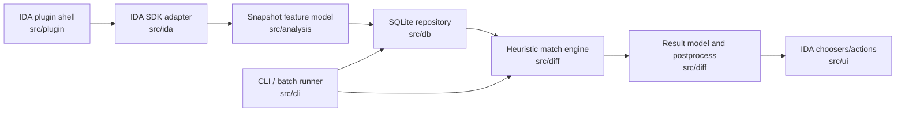

# soff rewrite project

## 架构图



`docs/architecture.svg` 保留了一份不依赖 Mermaid 渲染的静态架构图。

## 目录树

```text
soff/
|-- .gitignore
|-- codemap.md
|-- ida-plugin.json
|-- project.md
|-- xmake.lua
|-- ida-sdk-93-main/              # IDA 9.3 C++ SDK, kept as vendored SDK input
|   |-- docs/
|   `-- src/
|       |-- include/
|       |-- lib/
|       |-- plugins/
|       `-- ...
|-- docs/
|   `-- architecture.svg
|-- include/
|   `-- soff/
|       |-- analysis/
|       |   `-- model.hpp
|       |-- core/
|       |   `-- version.hpp
|       |-- db/
|       |   `-- repository.hpp
|       |-- diff/
|       |   `-- matcher.hpp
|       |-- export/
|       |   `-- exporter.hpp
|       |-- ida/
|       |   `-- adapter.hpp
|       `-- ui/
|           `-- actions.hpp
|-- scripts/
|   `-- install-plugin.ps1
|-- src/
|   |-- analysis/
|   |   `-- model.cpp
|   |-- cli/
|   |   `-- main.cpp
|   |-- core/
|   |   `-- version.cpp
|   |-- db/
|   |   `-- repository.cpp
|   |-- diff/
|   |   `-- matcher.cpp
|   |-- export/
|   |   `-- exporter.cpp
|   |-- ida/
|   |   `-- adapter.cpp
|   |-- plugin/
|   |   `-- soff_plugin.cpp
|   `-- ui/
|       `-- actions.cpp
`-- tests/
    `-- smoke.cpp
```

## 构建入口

- `xmake` 构建默认目标：`soff_core`、`soff_cli`、`soff_smoke`。
- `xmake run soff_smoke` 运行核心模型烟测。
- `xmake f --ida_plugin=true --ida_sdk=ida-sdk-93-main/src` 启用 IDA 插件目标。
- `scripts/install-plugin.ps1` 将构建出的 `soff.dll` 复制到 `D:\IDAPro9.3\plugins`。

## IDA 9.3 文档结论

- C++ 插件核心入口是导出的 `plugin_t PLUGIN` 描述块。
- 推荐使用继承 `plugmod_t` 的上下文类承载插件状态，`init()` 返回该实例。
- `loader.hpp` 提供 PLUGIN/IDP/LDR 模块接口，`kernwin.hpp` 承载 UI 与消息接口，`bytes.hpp`、`funcs.hpp`、`ua.hpp`、`netnode.hpp` 分别覆盖字节、函数、指令分析与数据库私有状态。
- Hex-Rays 反编译器能力通过 `hexrays.hpp`、`init_hexrays_plugin()` 和事件 callback 接入，应放在 IDA 适配层，不进入核心 diff 算法层。
- IDA 9.x API 有明显迁移点，后续实现应优先以 `ida-sdk-93-main/src/include` 为准，不照搬旧版 IDAPython 或 8.x C++ 习惯。
